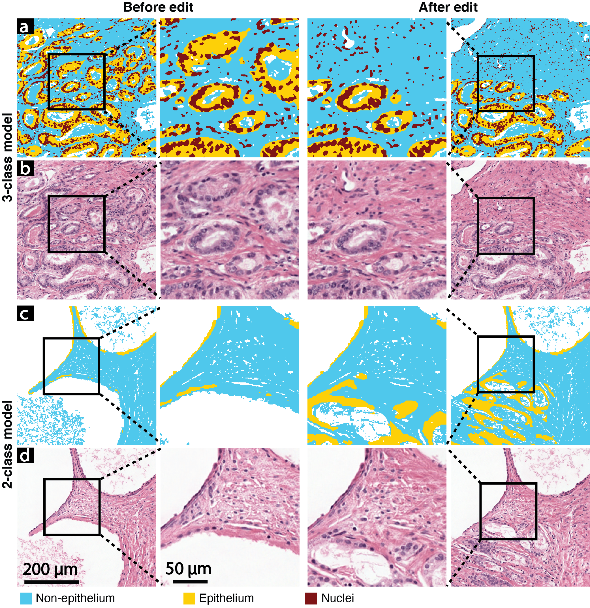

# Deepfake histological images for enhancing digital pathology  
### [Paper](https://www.sciencedirect.com/science/article/pii/S002368372200006X)
```
@article{FALAHKHEIRKHAH2023100006,
title = {Deepfake Histologic Images for Enhancing Digital Pathology},
journal = {Laboratory Investigation},
volume = {103},
number = {1},
pages = {100006},
year = {2023},
issn = {0023-6837},
doi = {https://doi.org/10.1016/j.labinv.2022.100006},
}
```


We present an approach to not only generate histological images that reproduce the diagnostic morphologic features of common disease but also provide a user ability to generate new and rare morphologies.  Our approach involves developing a generative adversarial network (GAN) model that synthesizes pathology images constrained by class labels.  We investigated the ability of this framework in synthesizing realistic prostate and colon tissue images and assessed the utility of these images in augmenting the diagnostic ability of machine learning methods as well as their usability by a panel of experienced anatomic pathologists.  Synthetic data generated by our framework performed similar to real data when training a deep learning model for diagnosis. Pathologists were not able to distinguish between real and synthetic images and their analyses showed a similar level of inter-observer agreement for prostate cancer grading. We extended the approach to significantly more complex images from colon biopsies and showed that the morphology of the complex microenvironment in such tissues can also be reproduced.  Finally, we present the ability for a user to generate deepfake histological images via a simple markup of sematic labels.  

## Requirements
- This source has been tested on Ubuntu 18.04.4 and macOS Big Sur
- CPU or NVIDIA GPU (for training, we recommend having a >10GB GPU)
- Python 3.7.1 
- CUDA 10.1
- PyTorch 1.3

## Python Dependencies
- numpy
- scipy
- torch
- torchvision
- sys
- PIL

## Training 

- The training dataset is available upon reasonable request. 
- For training, please put the dataset in proper directory and use this command:
```bash
python training.py --n_epochs [number of epochs] --batch_size [batch size] --lr [learning rate] 
```
-For GUI:
```bash
python GUI.py
```
For reproducing the results you can download the pretrain model from [here.](https://uofi.box.com/s/e8kawvar5z17hjc8bixwkfg2fsdoawkj)
## An example of GUI


### Results


### References
https://github.com/NVlabs/SPADE |
https://github.com/eriklindernoren/PyTorch-GAN |
https://github.com/vacancy/Synchronized-BatchNorm-PyTorch
